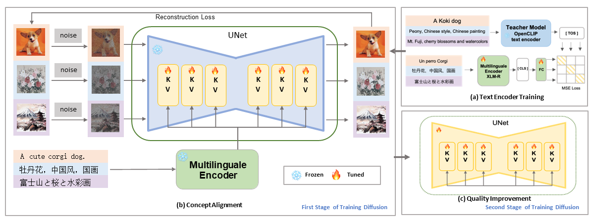
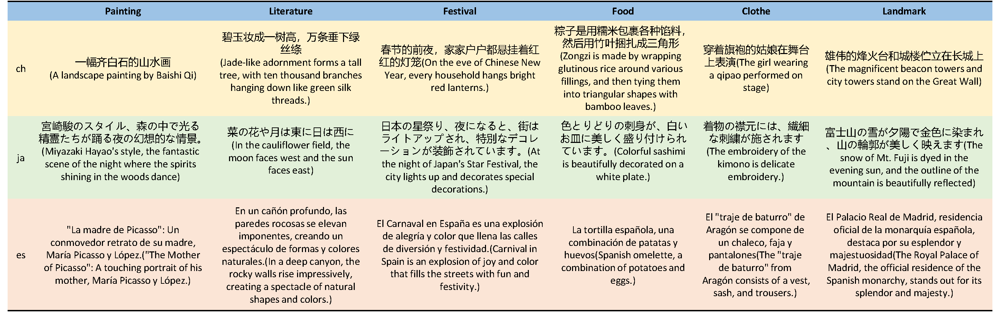

# AltDiffuson
Source code for paper: ["AltDiffusion: A multilingual Text-to-Image diffusion model"](https://arxiv.org/abs/2308.09991)

Our project is also spported in [FlagAI](https://github.com/FlagAI-Open/FlagAI), [Diffusers](https://github.com/huggingface/diffusers/tree/main/src/diffusers/pipelines/alt_diffusion) and [WebUI](https://github.com/AUTOMATIC1111/stable-diffusion-webui).

We release the checkpoints of AltDiffusion [m2](https://huggingface.co/BAAI/AltDiffusion), [m9](https://huggingface.co/BAAI/AltDiffusion-m9) and [m18](https://huggingface.co/BAAI/AltDiffusion-m18).

News: Our paper is accepted by AAAI 2024.

## 🏴 Introduction

we introduce a novel multilingual T2I diffusion model, which is capable of processing eighteen languages[^1] that cover 46.94\% of the world's first-language speakers and 27.64\% of the world's second-language speakers, named **AltDiffusion(AD)**, along with an efficient training approach shown in bellow.



Specifically, we first train a multilingual text encoder based on the knowledge distillation. Then we plug it into a pretrained English-only diffusion model and train the model with a two-stage schema to enhance the multilingual capability, including concept alignment and quality improvement stage on a large-scale multilingual dataset LAION5B. The overall ability is shown bellow, the images are generated by Altdiffusion with prompts in various languages. We select prompts with culture-specific concepts in different languages to demenstrate the strong capability of multilingual T2I generation of AltDiffusion.


Cause the AAAI could not put the table in the image manner, we put the MC-18 example here for the reader who insteresting in the data format.


[^1]:Eighteen languages: English, Chinese, Japanese, Thai, Korean, Hindi, Ukrainian, Arabic, Turkish, Vietnamese, Polish, Dutch, Portuguese, Italian, Spanish, German, French, and Russian.

## 👐 Project Structure

### 1.1 ckpt

Storing ckpt for different models

### 1.2 src

Contains the main model, training code;

#### 1.2.1 callbacks

Contains various log implementations, inserted through callback functions during training;

#### 1.2.2 configs

Training and reasoning profiles

#### 1.2.3 ldm

The body code for stable diffusion is all here

#### 1.2.4 lm

The model code for altclip is all here

#### 1.2.5 scripts

Training startup code


Dataclass.py： Data loading class

lr_scheduler.py: Setting of learning rate

1.3 misc

Includes data preprocessing, model inference, evaluation, and more; (dirty folder)


## 🔨 Environment Configuration

```python
pip install torch 1.12.1 torchvision 0.13.1
cd src
pip install -r requirements.txt
```

## 🛫 Training

The training startup script is located in src/scripts/run_multinode.sh. This script is not subject to change. The code path and saved log.txt path should be changed when first used.

The training configuration parameter Settings are located in /src/configs/train_multi.yaml, where all parameters that need to be modified are located.

Therefore, the training operation process is as follows:


1. Modify training configuration parameters, such as learning rate, data, etc.;

2. Run the command to fill in:

```python
bash your_codepath_to_altdiffusion/src/scripts/run_multinode.sh
```

## 🚀 Inference

Inference scripts are located at misc/nb/inference.ipynb, and simply replace the opt.ckpt in them to test different models

## 📐 Evaluation

/misc/evaluation is the source code for MS-COCO evaluation, including translate script, generation script, and metrics calculation script.

/misc/evaluation_new is the source code for MG-18 evaluation(mentioned in the paper), including translate script, generation script, and metrics calculation script.

/misc/human_evaluaiton is the source code for MC-18 evaluation(mentioned in the paper), including translate script,
evaluation interface.

## ✒ Citation
Please cite our paper if you find it helpful :)
```
@misc{ye2023altdiffusion,
      title={AltDiffusion: A Multilingual Text-to-Image Diffusion Model}, 
      author={Fulong Ye and Guang Liu and Xinya Wu and Ledell Wu},
      year={2023},
      eprint={2308.09991},
      archivePrefix={arXiv},
      primaryClass={cs.CV}
}
```
